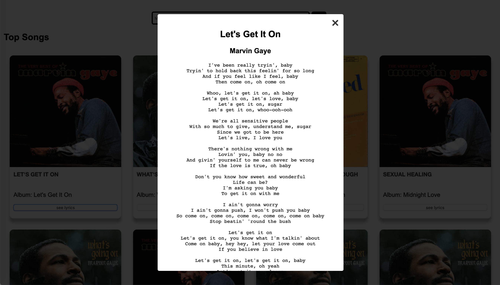

# Lyric-Tunes

## Description 

Lyric-Tunes allows users to search for any specific artist and get a list of their top songs. The user may request to see the lyrics for any chosen song. 

## Demo
- [Live Demo](https://carlosdeo.github.io/Lyric-Tunes/)

## Screenshots

### _Home Page_

### _Search Results_

### _Lyric Results_

  
## Technologies Used

### Languages
  * HTML
  * CSS
  * Javascript
  * Jquery
  
### Software
  * VS Code
  * Postman
  
### API
  * lyrics.ovh  [Documentation](https://lyricsovh.docs.apiary.io/#)
  * Last.fm  [Documentation](https://www.last.fm/api)
